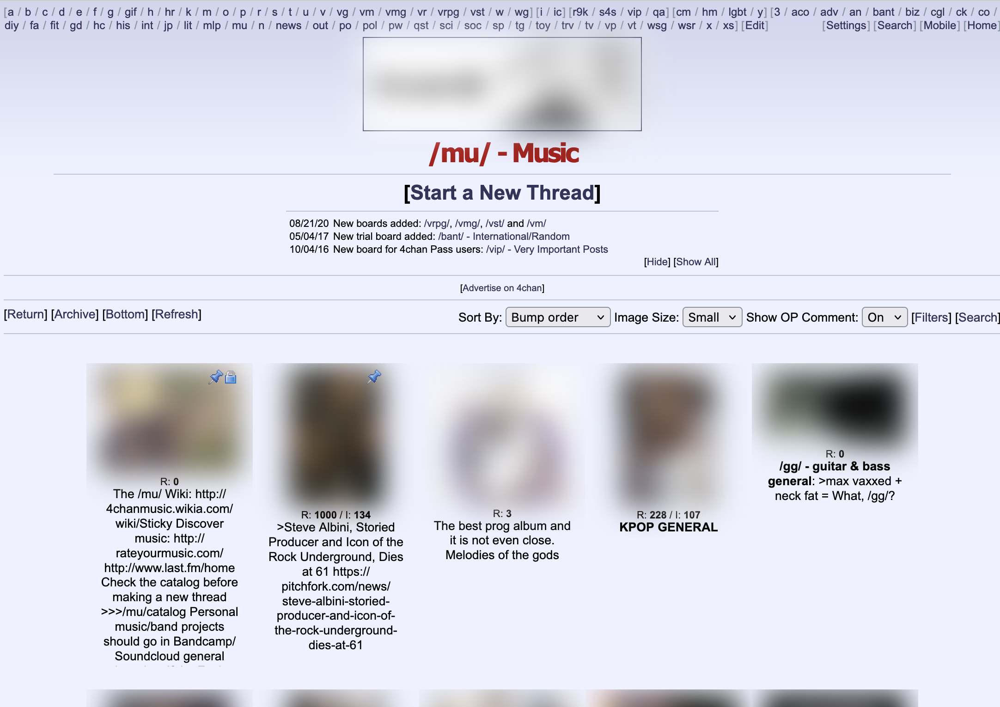

# deepblur
DeepBlur: Firefox extension that blurs images

## Installing locally

Per the [instructions on Mozilla](https://extensionworkshop.com/documentation/develop/temporary-installation-in-firefox/):

1. open Firefox
2. enter "about:debugging" in the URL bar
3. click "This Firefox"
4. click "Load Temporary Add-on"
5. open the extension's directory and select any file inside the extension, or select the packaged extension (.zip file).